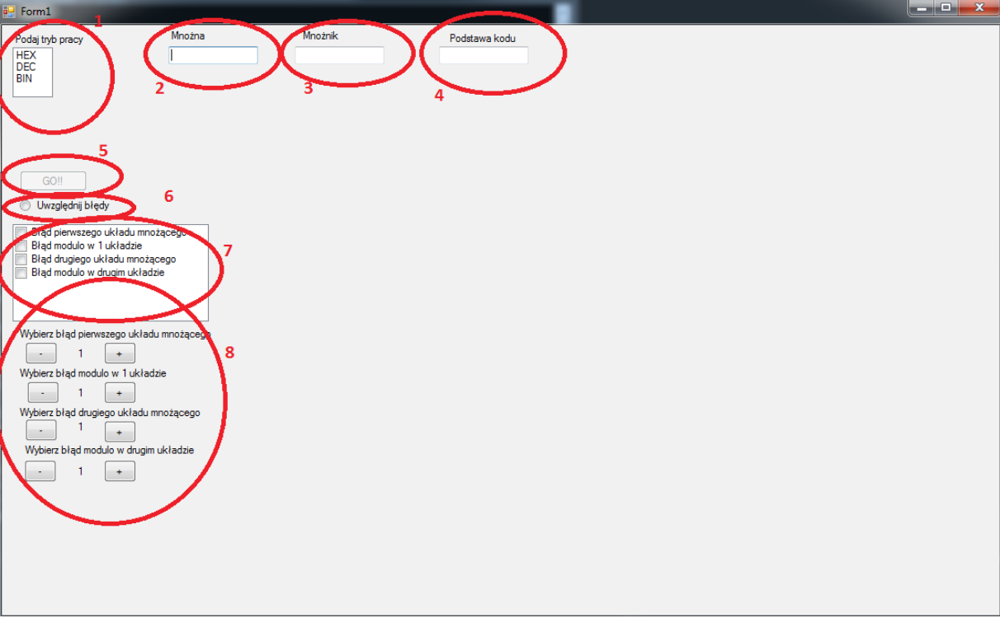
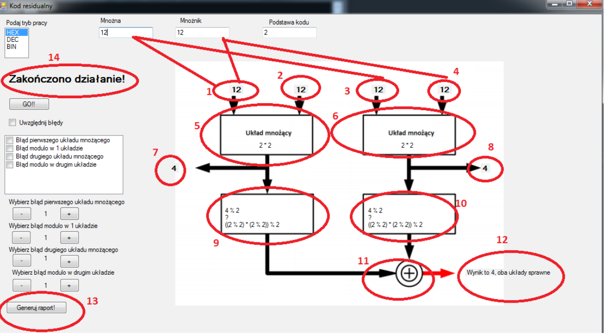
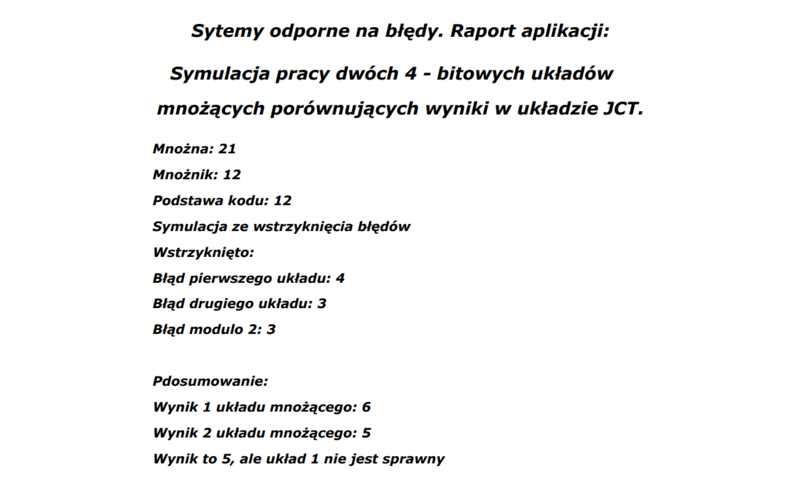

# Simulation of work of two 4-bit multiplier comparing the results in the JCT system

Simple simulation app created with C# .Net, WCF and Windows Forms.

## Table of contents
* [Setup](#setup)
* [Features](#features)
* [Screen shots](#screen-shots)

## Setup
The application works on the Windows operating system. It is necessary for commissioning
.NET platform.

## Features
* Simulation system
* Injection of 4 errors:
- first multiplier error
- second multiplier error
- first modulo error
- second modulo error
* Generating reports

## Screen shots

1. Operation mode. The user enters the operating mode in which the program is to operate. They exist
three modes:
 HEX - (hexadecimal) mode representing numbers in the hexadecimal system
 DEC - (decimal) mode representing numbers in the decimal system
 BIN - (binary) mode representing numbers in a binary system
2. Multiplied. The user enters the first number to be entered
the multiplier system.
3. Multiplier. The user enters the second number to be entered
the multiplier system.
4. Code basis. The user enters the number to be the basis for the residual code.
5. "GO !!" button. Runs the program and allows you to start working with the JCT system.
6. Include errors. It allows you to deliberately introduce errors into the system.
7. Checked list box. Allows you to choose errors. to be entered into the system.
The default error value is one.
8. Allows you to enter your own error values.
Figure 6.2 shows the window after entering the appropriate values ​​and clicking
"GO !!" button

Individual markings are responsible for:
1. Input of the first number of the first multiplier.
2. Input of the second number of the first multiplier.
3. Input of the first number of the second multiplier.
4. Input of the second number of the second multiplier.
5. First multiplier.
6. Second multiplier.
7. Result of the first multiplier.
8. Result of the second multiplier.
9. Calculating the remainder of the first multiplier.
10. Calculating the remainder of the second multiplier.
11. Comparator.
12. The result of the JCT system.
13. Generating a report on the application's operation in the form of a pdf file.
14. Information on successful completion of the simulation.
The application has been secured as follows:
• The button responsible for starting systems is initially disabled. Inclusion occurs
only after completing the appropriate fields.
• The multiplier, multiplier and code base fields are secured depending on the system.
 Selecting "HEX" results in the option of entering only numbers 0 -9 and letters a-f or A-F.
 Selecting "DEC" results in the option of entering only numbers 0-9.
 Selecting "BIN" results in the possibility of entering only zeros and ones.

Generated report:

